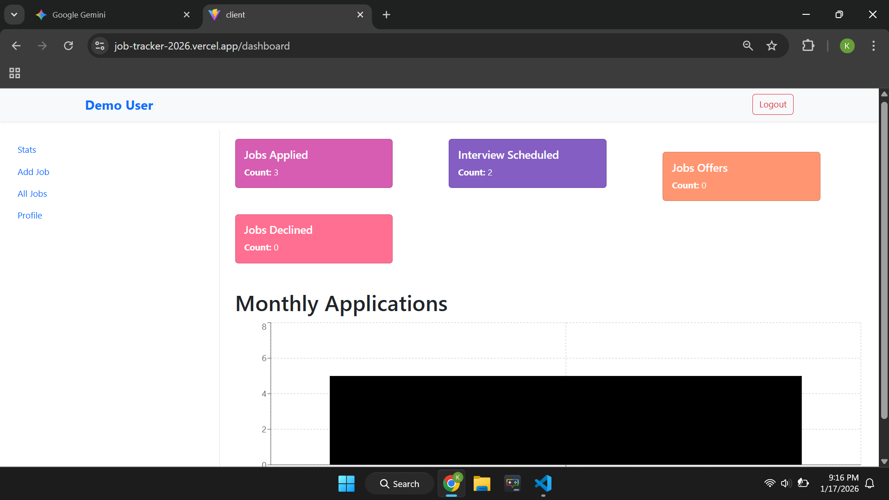

# Jobster - Intelligent Job Application Tracker



## 🚀 Live Demo

**[Launch Jobster](https://job-tracker-2026.vercel.app)**

- **Test Account:** `demo@examople.com` / `ksharma9883`

---

## 📖 About

Searching for a job is chaotic. Using spreadsheets to track hundreds of applications is tedious and provides no insights.
**Jobster** is a full-stack MERN application that centralizes your job hunt. It doesn't just store data; it provides **real-time analytics** on your progress, helping you visualize your application trends and status distribution.

## ✨ Key Features

- **📊 Advanced Analytics:** Visualizes application status (Applied , Interview , Declined , Offer) using **Recharts**.
- **⚡ High-Performance Stats:** Utilizes **MongoDB Aggregation Pipelines** to calculate stats on the server-side, reducing frontend payload.
- **🔐 Secure Authentication:** Complete JWT-based auth flow with HTTP-only cookies and protected routes.
- **📱 Responsive Dashboard:** Built with React & Styled Components for a seamless mobile and desktop experience.
- **🔎 Smart Search:** Filter jobs by status, type, or search keywords instantly with debounced inputs.

## 🛠️ Tech Stack

- **Frontend:** React.js, Redux Toolkit, Styled Components, Recharts
- **Backend:** Node.js, Express.js
- **Database:** MongoDB (Atlas), Mongoose
- **DevOps:** Vercel (FE), Render (BE), CI/CD pipeline

## 🏗️ Architecture Highlight: Aggregation Pipeline

Instead of fetching all jobs and filtering them in the browser (O(N) bandwidth), Jobster uses MongoDB's aggregation framework to process data directly in the database layer:

```javascript
// Example of the Aggregation Logic used
await Job.aggregate([
  { $match: { createdBy: mongoose.Types.ObjectId(req.user.userId) } },
  { $group: { _id: "$status", count: { $sum: 1 } } },
]);
```

## 🔧 Installation & Setup

**Clone the repo** :

- git clone [https://github.com/Kulkant/job-tracker-2026.git](https://github.com/Kulkant/job-tracker-2026.git)
- cd jobster
- Install Dependencies
  -npm run setup-project

**Environment Variables Create a .env file in the root:**

Code snippet

- **MONGO_URL**=your_mongodb_connection_string
- **JWT_SECRET**=your_jwt_secret
- Start the App

Bash

npm start

## 👤 Author

Kulkant Sharma | [Linkedin](www.linkedin.com/in/kulkant-sharma-b178a8393)| [Github](https://github.com/Kulkant)
